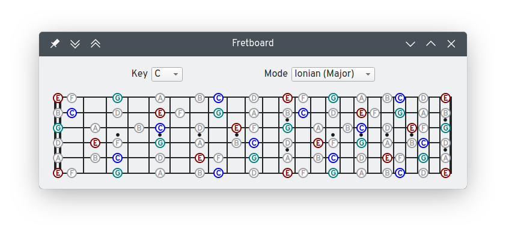
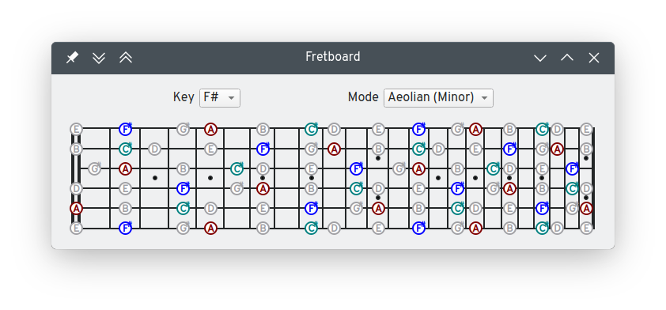

# FretboardVisualizer
Simple GUI application to visualize scale degree positions across the fretboard of a guitar. Written in Go

# Screenshots

# Scales calculation
For a given scale and in a given key the scale degrees need to be extracted. Each scale can be represented as the intervals of all notes up to (not including) the octave. Those intervals need to be applied as offsets to the key to produce the note values in the scale. To apply the scale to a guitar fretboard those notes need to be "offset" by the note of the open string for each string.

use cases
user selects a key and a mode, the music module needs to provide a mechanism for:
    extracting the note values of each scale degree
    extracting the interval for each scale degree
    finding all note values on a given string
        Could be done by having a function that returns all notes in an interval
